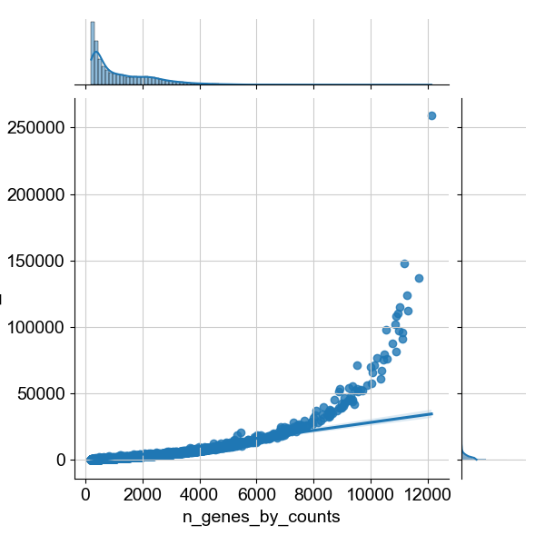
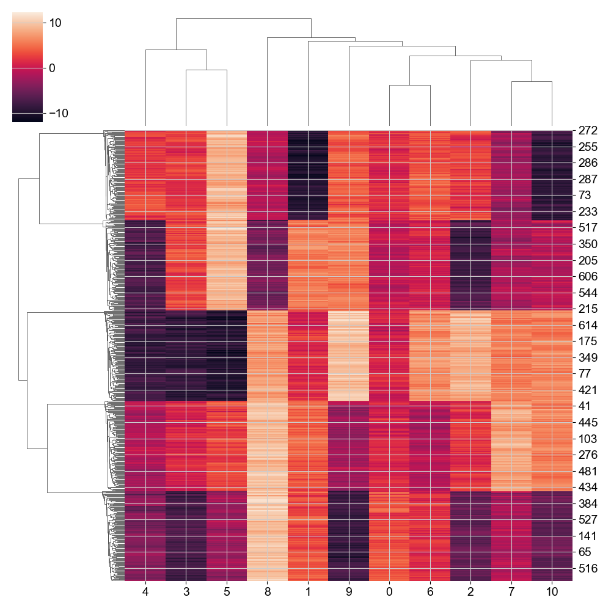

# Ovarian Cancer Metrics Analysis

## Context
Genomics data is considered to be very complex and hard to interpret. As such there is a necessity to properly clean and draw meaningful insights from the data. 
As seen in my scanpy tutorial work-along, these imperative steps can be achieved by preprocessing and then clustering genomic data.

> - Preprocessing will improve data quality by standardizing it and preparing it for clustering to minimize skewing.
> - Clustering will reduce the complexity of high-dimensional data, allowing us to focus on key features and patterns in the data.
>

## Walk-Through
I will practice preprocessing and clustering single-cell data for ovarian cancer cells by using the scanpy toolkit. 
I hope to expand improve my preprocessing methods to minimize data skewing, allowing my clustering to provide more accurate insights.

## Top 25 Genes

## Number of Genes with Positive Counts in a Cell vs Total Counts of Cells

## High Variable Genes

## Hierarchically-Clustered Heatmap - Gaussian Blobs
